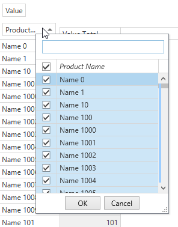

<!-- default file list -->
*Files to look at*:

* [CustomFilterPopup.cs](./CS/CustomFilterPopup/CustomFilterPopup.cs) (VB: [CustomFilterPopup.vbproj](./VB/CustomFilterPopup/CustomFilterPopup.vbproj))
* [MainWindow.xaml](./CS/CustomFilterPopup/MainWindow.xaml) (VB: [MainWindow.xaml](./VB/CustomFilterPopup/MainWindow.xaml))
* [MainWindow.xaml.cs](./CS/CustomFilterPopup/MainWindow.xaml.cs) (VB: [MainWindow.xaml.vb](./VB/CustomFilterPopup/MainWindow.xaml.vb))
* [CustomFilterPopupTemplateSelector.cs](./CS/CustomFilterPopup/CustomFilterPopupTemplateSelector.cs) (VB: [CustomFilterPopupTemplateSelector.vb](./VB/CustomFilterPopup/CustomFilterPopupTemplateSelector.vb))
<!-- default file list end -->
# How to Implement a Custom Filter Popup

This example uses custom FilterPopupTemplateSelector that allows to to provide different filter data templates for different fields. Now it replaces all default filters with a custom control inherited from the [LookUpEdit](https://docs.devexpress.com/WPF/8862/controls-and-libraries/data-editors/editor-types/lookupedit) class.

> Starting from v19.1.5 it is also possible to customize the Filter Popup used by the Excel style filter using the [PivotGridField.CustomExcelStyleFilterPopupTemplate](https://docs.devexpress.com/WPF/DevExpress.Xpf.PivotGrid.PivotGridField.CustomExcelStyleFilterPopupTemplate) property.

See also:

* [Filtering Basics](https://docs.devexpress.com/WPF/8010)
