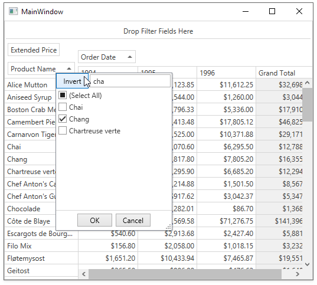

<!-- default file list -->
*Files to look at*:

* [CustomFilterPopup.cs](./CS/CustomFilterPopup/CustomFilterPopup.cs) (VB: [CustomFilterPopup.vbproj](./VB/CustomFilterPopup/CustomFilterPopup.vbproj))
* [MainWindow.xaml](./CS/CustomFilterPopup/MainWindow.xaml) (VB: [MainWindow.xaml](./VB/CustomFilterPopup/MainWindow.xaml))
* [MainWindow.xaml.cs](./CS/CustomFilterPopup/MainWindow.xaml.cs) (VB: [MainWindow.xaml.vb](./VB/CustomFilterPopup/MainWindow.xaml.vb))
* [StringToFilterCriteriaMultiConverter.cs](./CS/CustomFilterPopup/StringToFilterCriteriaMultiConverter.cs) (VB: [StringToFilterCriteriaMultiConverter.vb](./VB/CustomFilterPopup/StringToFilterCriteriaMultiConverter.vb))
<!-- default file list end -->
# How to Implement a Custom Filter Popup

This example uses a custom data template with a custom control inherited from the [ComboBoxEdit](https://docs.devexpress.com/WPF/DevExpress.Xpf.Editors.ComboBoxEdit) class. It implements incremental search and allows you to invert selection.
 
The data template is assigned to the [PivotGridField.HeaderTemplate](https://docs.devexpress.com/WPF/DevExpress.Xpf.PivotGrid.PivotGridField.HeaderTemplate) property.

See also:

* [Filtering Basics](https://docs.devexpress.com/WPF/8010)
